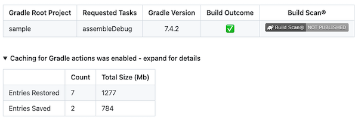

[](https://github.com/yumemi-inc/setup-java-gradle/actions/workflows/ci.yml)

# Setup Java - Gradle

A GitHub Action that sets up a Java and Gradle environment.
It is a composite action that uses the following actions.

- [actions/setup-java](https://github.com/actions/setup-java)
- [gradle/gradle-build-action](https://github.com/gradle/gradle-build-action)
- [yumemi-inc/problem-matchers/kotlin-gradle](https://github.com/yumemi-inc/problem-matchers/tree/main/kotlin-gradle)

Simplify workflow steps and do not write Gradle cache by default.

## Usage

See [action.yml](action.yml) for available action inputs.
However, since it is only being passed, refer to the original action's README and action.yml for details.

Currently, the minimum input items are passed.

### Basic

Place this action step before Gradle tasks.

```yaml
- uses: actions/checkout@v4
- uses: yumemi-inc/setup-java-gradle@v2
- run: ./gradlew ...
```

By default, the Java version set up is `17`.
Because it is the mainstream in current Android application development.
If you want to change the version, specify it with `java-version` input.

## About writing cache

By default, the internally used *gradle/gradle-build-action* writes cache in workflow on default branch, but to prevent careless writes, this *yumemi-inc/setup-java-gradle* action does not write cache anywhere by default.

You can set `cache-read-only` input to `false` when you want to write the cache, but it is simpler to prepare the following workflow.

```yaml
name: Cache Generation

on:
  schedule:
    - cron: '0 */6 * * *' # for example, every 6 hours

jobs:
  cache-generation:
    runs-on: ubuntu-latest
    permissions:
      contents: read
    steps:
      - uses: actions/checkout@v4
        # with: 
        #   ref: .. # specify if there is a branch other than the default branch where the code is frequently updated
      - uses: yumemi-inc/setup-java-gradle@v2
        with:
          cache-read-only: false
          gradle-home-cache-cleanup: true
      - run: ./gradlew dependencies # some Gradle task
```

Workflows triggered by [schedule](https://docs.github.com/en/actions/using-workflows/events-that-trigger-workflows#schedule) events run on the default branch, and cache is written to the default branch.
Cache on default branch available for all workflows.
Alternatively, if the default branch is frequently updated, you can trigger [push](https://docs.github.com/en/actions/using-workflows/events-that-trigger-workflows#push) events on the default branch rather than schedule events.

In the above workflow, `true` is specified for `gradle-home-cache-cleanup` input to prevent size increase due to cache accumulation, but if reusability is a priority, specify `false`(default).

When writing to cache, the Gradle daemon is automatically stopped by internally used *gradle/gradle-build-action*, so there is no need to explicitly stop it.

The cache read/write status is displayed in the Job Summaries as shown below, so check this and adjust your workflow.



## Using Gradle build cache

Build cache can be enabled with the `gradle.properties` file or with the following environment variable:

```yaml
- run: ./gradlew ...
  env:
    GRADLE_OPTS: '-Dorg.gradle.caching=true'
```

Note that this option is required not only when reading the cache, but also when writing it.

When writing the build cache, it is recommended to run a Gradle task that has many intermediates, such as a build task.

Some reusable items are used, even if they are intermediates between different Gradle tasks.
Check the Gradle task log to see how much cache is used.

```
BUILD SUCCESSFUL in 34s
164 actionable tasks: 64 executed, 100 from cache
```
